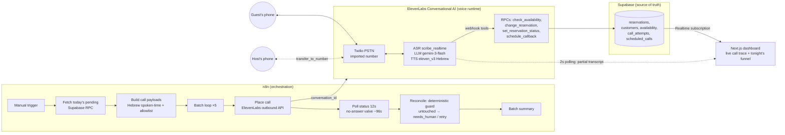

# Final Assignment – Generative AI Systems Design & Implementation

| | Name | Email |
|---|---|---|
| **Student 1** | Re'i Biton | _(fill)_ |
| **Student 2** | Haim Toledano | _(fill)_ |
| **Student 3** | Tomer Elzam | mrelzam@gmail.com |

**Project: Maître (מיקה) — an autonomous Hebrew voice agent that calls restaurant guests to confirm tonight's reservations.**

Code repository: **https://github.com/AGENTEAMS/voice-agent**

---

## 1. Problem Selection & Definition (5%)

### Chosen Business Problem

In our work with **Kisu (קיסו)**, a Tel-Aviv restaurant we consult for, we observed that the host team spends **1.5–2 hours every afternoon** phoning guests to confirm that evening's reservations — and on busy days the calls simply don't all get made. Unconfirmed reservations turn into no-shows: a held table on a Friday night is unsellable inventory. Industry data consistently places restaurant no-show rates at **10–20%**, and confirmation calls are the single most effective countermeasure — but they are exactly the work a small host team doesn't have time for.

> In our role as AI consultants for Kisu restaurant, we observed that daily reservation-confirmation calls are either consuming ~2 hours of staff time or silently not happening. This impacts the restaurant through no-show revenue loss (a 4-top held and unfilled on a peak night), and impacts guests through inability to easily adjust or cancel — which itself produces more no-shows.

### Background & Context

- **Industry/Domain:** Hospitality — restaurant front-of-house operations (Israel; Hebrew-speaking guests).
- **Current Processes or Systems:** A hostess works through today's reservation list by phone between lunch and dinner service: dial, confirm/adjust/cancel, update the reservation book, redial the no-answers. Reservation platforms used in the market send SMS reminders, but SMS is one-directional in practice — guests ignore it, and it cannot negotiate ("21:30 is full, can you do 22:00?").
- **Pain Points:** (1) Staff time — repetitive calls during prep hours; (2) Inconsistency — calls skipped on busy days, exactly when no-shows hurt most; (3) No negotiation in SMS reminders — a guest who wants to move their slot just doesn't show instead; (4) No reliable record — outcomes live in a notebook or in someone's head.
- **Business Impact:** Recovered table inventory (cancellations surfaced hours before service can be resold), ~2 staff-hours/day returned to guests in the restaurant, and a complete digital audit trail of every confirmation decision.

---

## 2. Market Research & Technical Discovery (15%)

### Market Landscape

- **Existing Solutions:**
  - *Reservation platforms (Ontopo, Tabit, OpenTable):* manage bookings and send SMS/push reminders. None place outbound voice calls; none negotiate alternatives; Hebrew voice is out of scope for all of them.
  - *Generic voice-agent platforms (Vapi, Retell AI, Bland.ai, Synthflow):* strong US/English-centric outbound calling stacks. Hebrew support ranges from absent to experimental; none ships a restaurant-reservation skill out of the box (we evaluated these as build-platforms, not as competitors — see Technical Discovery).
  - *Human call services / the status quo:* outsourced confirmation calling exists for clinics; for restaurants the "solution" is simply the hostess.
- **Market Gaps:** No product does **bidirectional, negotiating, Hebrew voice confirmation** with write-back into the reservation system. SMS reminders confirm perhaps the easy cases; the valuable cases — "can we move to 21:30?", "actually cancel it" — require a conversation.
- **Target Audience:** Mid-size restaurants in Israel (30–80 covers/night) with a reservation book and a thin host team; the buyer is the restaurant owner/manager, the daily user is the host team that consumes the outcome dashboard.

### Technical Discovery

- **Stakeholder Interviews:** Working sessions with the Kisu owner shaped three hard requirements: the agent must (1) sound like a pleasant human hostess in natural Israeli Hebrew — guests hang up on robots; (2) never invent availability — offers must come from the live reservation database; (3) hand off to a human on request, instantly.
- **Data Availability & Quality:** Reservations, customers, availability and call outcomes live in a Postgres schema (Supabase) we control — so in-call tools can read and write the source of truth directly. Telephony reachable via Twilio (international caller-ID verification done for the pilot number).
- **Feasibility Assessment / platform research:** We ran a structured vendor evaluation for the voice runtime (full report in the repo: `docs/knowledge/`). Key findings that drove the architecture:
  - **Hebrew TTS quality is the scarcest resource.** ElevenLabs' v3 conversational model is the only agent-platform TTS we found with production-grade Hebrew; that single fact anchored the platform decision.
  - **LLM choice inside the voice loop is constrained by tool-calling discipline**, not language ability: we evaluated 5 in-call models — gpt-4o-mini narrated outcomes without calling tools ("fake work"), gpt-5-mini was too slow (~10s latency), gemini-2.5-flash produced silent no-response turns, gpt-4o worked but was pricier, and **gemini-3-flash won — reliable tool-calling and ~7× cheaper than gpt-4o** (measured, not assumed).
  - **Latency budget:** a phone conversation tolerates ~1.5–2s of response gap before it feels broken. We measured the ElevenLabs pipeline (ASR→LLM→TTS) at ~1.0–1.6s end-to-end — feasible, with no headroom for extra LLM hops, which ruled out chained-orchestrator designs inside the call.
  - **Cost:** ≈ $0.026 per completed confirmation call on gemini-3-flash (platform + telephony at our measured 39s average) — ~7× cheaper than the same call on gpt-4o (≈ $0.18) — vs. ~3 minutes of staff time per manual call — favorable by an order of magnitude at scale.

---

## 3. Proposed GenAI System Architecture (20%)

### High-Level Overview

- **Solution Concept:** An autonomous outbound voice agent — persona **"Mika" (מיקה)**, the restaurant's digital hostess — calls each guest with a pending reservation for today, speaks natural Hebrew, and resolves the reservation: **confirm / change time or party size (negotiating against live availability) / cancel (capturing the reason) / schedule a callback / transfer to a human**. Every decision is written to the database **during the call** by the agent's tools. An orchestration layer batches the calls, supervises their outcomes, and deterministically catches anything the agent failed to record.
- **Key Functionalities & benefits:**
  - *Agent-speaks-first opener* personalized with guest name, time, and party size (technical: dynamic variables injected per call; business: zero awkward dead air on pickup).
  - *Live availability negotiation* — `check_availability` reads real slots; the agent offers alternatives only from tool results (technical: anti-hallucination tool contract; business: guests reschedule instead of no-showing).
  - *In-call database write-back* — confirm/cancel/change/callback all commit mid-call (business: the reservation book is always current; no transcription step).
  - *Human escape hatch* — conference transfer to the host's phone on request.
  - *Batch orchestration with a deterministic safety net* — unanswered guests are retried; reached-but-unresolved guests are flagged for human follow-up; an agent that *claims* an action without performing it is caught by reconciliation within seconds of call end.
  - *Live operations dashboard* — real-time trace of the conversation and tool calls during the demo/service, plus tonight's confirmation funnel.

### System Architecture Diagram

*(Data sources: Supabase reservation schema · Preprocessing: payload builder converts times to spoken Hebrew and injects per-call dynamic variables · GenAI components: ASR + LLM + TTS pipeline with tool calling · Output delivery & feedback loops: in-call DB write-back, post-batch reconciliation, live dashboard.)*

### Technology Stack

| Component | Technology Choice | Reason |
|---|---|---|
| Voice agent runtime (telephony + ASR + agent loop + TTS) | **ElevenLabs Conversational AI** | The only platform we found with production-grade **Hebrew** conversational TTS (eleven_v3); owns the full latency-critical loop so no glue code sits inside the 2s response budget |
| In-call LLM | **Gemini 3 Flash** (`gemini-3-flash-preview`, temp 0.3) | Winner of a 5-model eval: reliable tool-calling and ~7× cheaper than gpt-4o (≈$0.026 vs ≈$0.18/call). gpt-4o-mini faked tool use, gpt-5-mini was too slow, gemini-2.5-flash went silent, gpt-4o worked but cost more |
| Telephony | **Twilio** (number imported into ElevenLabs) | Reliable PSTN to Israel, verified caller-ID path, call-status API used for no-answer diagnosis |
| Database + in-call tools | **Supabase (Postgres + REST RPCs)** | Reservation source of truth; agent tools are thin webhook RPCs, so business rules live in SQL, not in the prompt; Realtime subscriptions power the live dashboard |
| Orchestration | **n8n (cloud)** | Visual, auditable batch pipeline: fetch pending → call → poll → reconcile → summarize; the deterministic safety net lives here, outside the probabilistic agent |
| Ops dashboard | **Next.js + Supabase Realtime** | Live trace of turns/tool-calls during a call and tonight's confirmation funnel — observability for demo and for the host team |
| Provisioning | **Python (provisioning-as-code)** | The entire agent (prompt, tools, voice settings) is declared in `provision_elevenlabs.py` and applied idempotently — no hand-edited dashboard state, full git history of every behavioral change |

---

## 4. Implementation (50%)

### Scoping the POC

- **Input:** Today's pending reservations (guest name, phone, time, party size) from the restaurant database.
- **Output:** Every called reservation leaves in exactly one resolved state: `confirmed` / `cancelled` (+reason) / changed-and-confirmed / callback scheduled / transferred to human / flagged `needs_human` / queued for retry — written in the database, never only spoken.
- **Success metric:** **Decision-capture integrity** — % of completed calls where the database state matches what was agreed on the call. (A voice agent that says "confirmed" without writing it is worse than useless — it manufactures false confidence.)
- **Minimum viable test set:** A 14-scenario live-call matrix executed against real phones: confirm; cancel (+reason capture); change-to-available-slot; change-to-full-slot (negotiation); open availability question; callback at a relative time ("in two hours"); callback at an absolute time; guest answers with a bare «כן»/«לא»; guest silent after opener; line-echo of the agent's own opener; background-noise answer; no-answer; instant hang-up; mid-conversation hang-up; transfer request.
- **Target:** 100% decision-capture integrity across the matrix (this is a correctness property, not an accuracy aspiration — see the deterministic guard below), agent response latency < 2s.

### Development Steps

1. **Data Preparation** — Designed the Supabase schema (reservations, customers, availability, call_attempts, scheduled_calls) and a deterministic seeding/reseeding tool (`supabase/reseed.py`) so every test/demo session starts from a known state; date-shift logic keeps "today's reservations" valid across days. Hebrew spoken-language preprocessing converts 21:30 → «תשע וחצי» and party sizes to natural Hebrew before each call.
2. **Model Integration** — Provisioned the ElevenLabs agent fully as code: Hebrew system prompt (persona, conversation routes, an explicit binding TOOL CONTRACT), 4 webhook tools mapped to Supabase RPCs + 2 system tools (end_call, transfer_to_number), v3 Hebrew TTS tuning (stability floor 0.75 — below it the audio warps; speed 0.7; pronunciation via alias respellings), ASR keyword boosting for short Hebrew answers, and turn-taking configuration (instant opener, echo-discard list, no-answer timeouts).
3. **Application Logic** — The n8n batch pipeline: fetch today's pending → safety allowlist (test numbers only — seed data contains fake numbers that must never be dialed) → sequential-batched outbound calls → status-aware polling (a no-answer resolves in ~96s; a live negotiation can run to 5 minutes uncut) → **deterministic reconciliation**: any *completed* call about a reservation that ends with neither a status change nor a scheduled callback is mechanically classified — never-connected → stays `pending` (next run auto-redials); engaged-but-unresolved → flagged `needs_human`. The classification reads only call status + duration + DB rows: zero AI judgment in the safety layer.
4. **Testing & Validation** — 30 live calls over real telephony (22 completed conversations, 14.3 talk-minutes; 8 engineered no-answers), every scenario in the matrix exercised end-to-end with database verification after each call. Each fix was re-verified by ear *and* by row: transcript, tool calls, and resulting DB state are checked together (`agent/call_and_verify.py` prints all three for every test call).

### Challenges & Solutions

- **Challenge 1 — The phantom guest (line echo).** Guests' phones echoed the agent's own opener back into the call; ASR transcribed fragments of her own sentence («לא, לא נוח») as guest speech, and the agent answered a guest who had said nothing — branching into a callback flow uninvited.
  **Solution:** Three-layer defense: per-turn timing forensics in the ElevenLabs transcript proved the "guest turn" was captured mid-opener (t=5s of a 14s opener); platform-level discard list for pure channel-noise («הלו» variants); prompt-level echo rule — a first turn that repeats the opener's own wording is treated as noise and answered with silence, not action.
- **Challenge 2 — The ignore-list that ate "yes".** Our first echo fix added «כן»/«לא» to the platform's interruption-ignore list — and we discovered the list filters utterances *globally*, not just during agent speech: a guest's bare «כן» answer vanished from the transcript entirely.
  **Solution:** Reverted decision words from the list (documented as a hard rule in code comments), moved echo defense to the prompt layer, and added ASR keyword boosting so short Hebrew answers («כן», «לא», «מגיעים») are reliably captured. Verified live.
- **Challenge 3 — The agent that lied about success.** In one verified call the agent *announced* «אישרתי» (confirmed) and ended the call — without ever calling `set_reservation_status`. The database still said `pending`. This is the canonical failure mode of LLM agents: narrating work instead of doing it.
  **Solution (two layers):** (a) Prompt: the confirm flow is tool-first — the tool call rides in the same turn as the bridge sentence, and past-tense completion words («אישרתי»/«מעודכן»/«ביטלתי») are forbidden unless a successful tool *result* already exists in the conversation. (b) System: the n8n reconciliation guard makes the property deterministic — any completed call that left no database trace is caught and flagged within seconds, regardless of what the LLM did. **The agent is probabilistic; the system is not.**
- **What if the POC didn't hit the target metric?** Before the tool-first fix, decision-capture integrity over decision-bearing calls was 14/15 (~93%) — one fabricated confirmation, caught by manual DB verification. Rather than only patching the prompt (probabilistic), we changed the architecture so the metric cannot silently degrade: post-call reconciliation reduces "agent forgot to write" from a correctness failure to a routed exception (`needs_human`). Post-fix verified calls: 100% integrity, and the guard now audits every future call automatically.

### System Performance

**Technical KPIs** *(measured over the live test campaign: 22 completed calls, 30 dials)*

| Metric | Description | Target | Achieved |
|---|---|---|---|
| Decision-capture integrity | % of completed calls where DB state matches the spoken agreement | 100% | **100%** post-fix (93% pre-fix; gap caught & closed by deterministic reconciliation) |
| Agent response latency | ASR-end → first TTS audio (measured per turn: LLM TTFB 0.46–1.05s + TTS TTFB 0.37–0.49s) | < 2 s | **≈1.0–1.6 s** |
| Tool-call grounding | Availability/changes spoken only from live tool results (no invented slots) | 100% | **100%** across test matrix (enforced by tool contract; verified per call) |
| Call completion handling | Every dial ends in a classified state (incl. no-answer→retry, hang-up→needs_human) | 100% | **100%** — 8/8 engineered no-answers correctly classified for retry |
| Avg. call duration | Guest time on the phone per resolved reservation | — | **39 s** (range 12–119 s) |

**Business KPIs** *(projected for a 40-reservation/night restaurant; baseline = manual calling; marked estimates)*

| Metric | Description | Baseline | After Implementation | Improvement |
|---|---|---|---|---|
| Staff time on confirmations | Hostess hours/day on calls + redials | ~2 h/day | ~10 min/day (review exceptions dashboard) | **~90%** |
| Confirmation coverage | % of tonight's reservations actually reached | 50–70% (busy days) | ~100% attempted, retries automatic | **+30–50pp** |
| Cost per confirmed reservation | Staff cost vs. platform+telephony (39s avg call) | ~₪6–8 (3 min staff time) | ~₪0.5 (≈$0.10–0.15) | **~10×** |
| Recoverable no-show inventory | Cancellations surfaced ≥3h before service (resellable tables) | reactive (no-show discovered at 20:00) | proactive (known by 17:00) | est. **2–4 tables/week** |

**Business Impact Highlights**

- **Operational Efficiency:** Confirmation calling is removed from the host team's afternoon entirely; the human role shifts to reviewing a short exception list (needs_human) on a dashboard.
- **Revenue Protection:** Every cancellation and time-change is captured hours before service while the table can still be resold; the cancellation *reason* is collected for management insight.
- **Customer Experience:** Guests get a pleasant 40-second Hebrew conversation that can actually solve their problem (move the slot, leave a message, reach a human) instead of an ignorable SMS.
- **Market Advantage:** To our knowledge, no Israeli reservation product offers negotiating Hebrew voice confirmation; the restaurant operates as an early adopter with a defensible ops improvement.

**Strategic Scalability Potential**

- Same architecture serves **inbound** reservation-taking (the agent already reads/writes the same availability tools).
- Multi-restaurant SaaS: restaurant_id is already a parameter on every tool — onboarding a second restaurant is data, not code.
- The deterministic-reconciliation pattern (probabilistic agent + mechanical guard) generalizes to any agentic write-path: clinics, salons, service businesses.

**Screenshots / Code Snippets:** see Appendix in the slide deck + repository README (live dashboard, n8n pipeline, transcript-with-tool-calls excerpts).

**Code repository:** https://github.com/AGENTEAMS/voice-agent

---

## 5. Pitch to Class (10%)

*Planned flow (8 min):*

- **Hook:** Play 15 seconds of a real recorded call — the room hears a natural Hebrew hostess negotiating; then reveal: «היא לא בן אדם». *(Fallback: live call on stage with the dashboard tracing it.)*
- **Problem:** Every evening, in thousands of restaurants, someone either spends two hours calling tonight's guests — or doesn't, and eats the no-shows.
- **Solution Overview:** Mika — a digital hostess that calls, negotiates against the live reservation book, writes every outcome to the database mid-call, and escalates to a human when it matters. A deterministic orchestration layer guarantees nothing falls through.
- **Demo:** Live batch run from n8n → a real phone rings on stage → confirm-with-a-twist (move the time; she negotiates a full slot) → the dashboard shows turns, tool calls, and the reservation flipping to confirmed in real time.
- **Business Value:** ~2 staff-hours/day → 10 minutes of exception review; ~10× cheaper per confirmation; cancellations surfaced while tables are still resellable.
- **Call to Action:** Pilot running for Kisu; next: inbound reservations + multi-restaurant rollout. *"The agent is probabilistic. The system is not."*

---
*Document maps 1:1 to the course template; KPI figures marked "est." are projections, all other numbers are measured from the live test campaign (conversation IDs and DB rows auditable in the repo/Supabase).*
